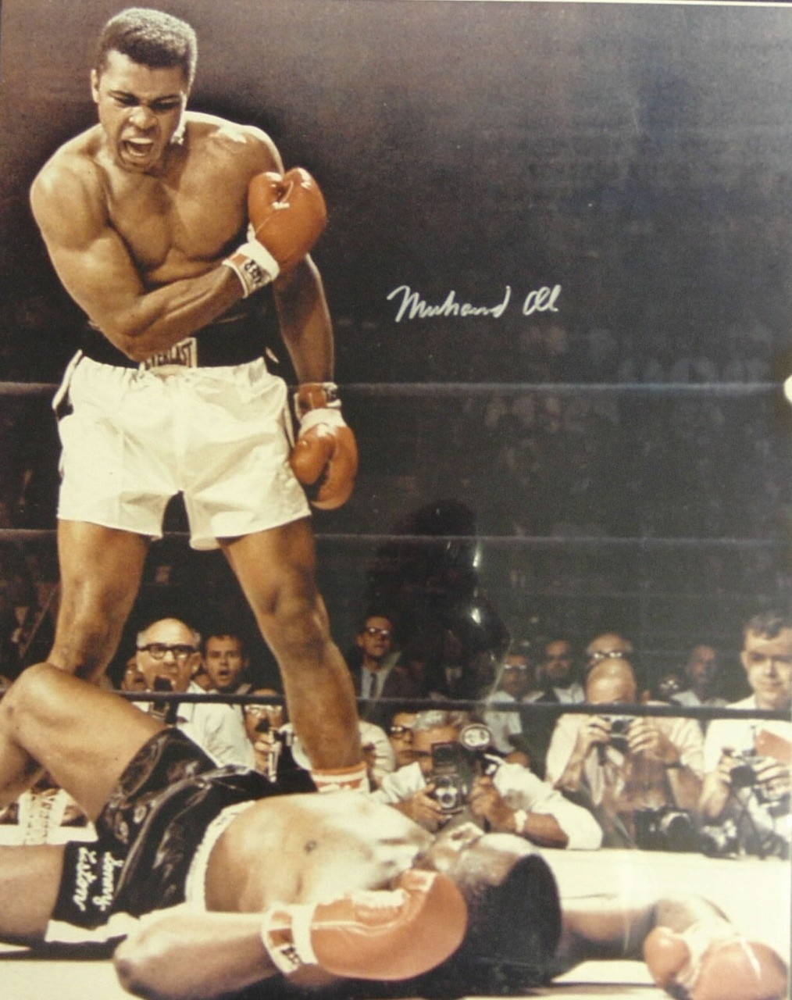
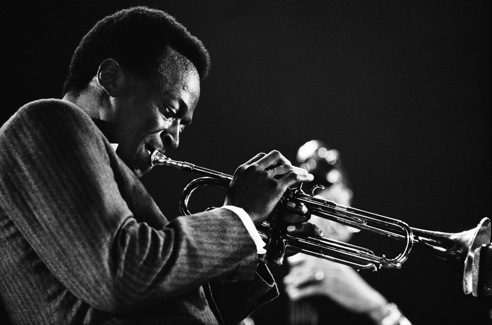
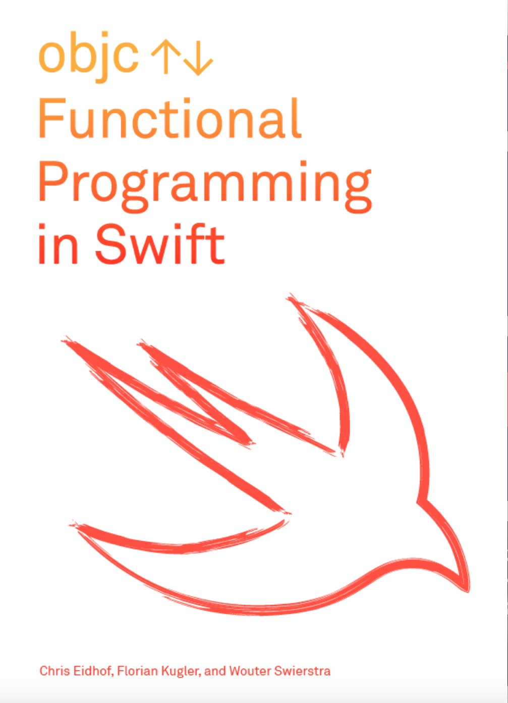

# [fit] Sísifo
## o *"Cómo empezar de nuevo - y otra vez"*

---
## Lecciones aprendidas de migrar de Objective-C a Swift
#### *Sin hablar mucho de Objective-C o Swift*

^ En esta charla hablaré un poco sobre mis comienzos en Axiom Zen y las lecciones que he aprendido al pasar de Objective-C a Swift - sin hablar mucho ni de Objective-C ni de Swift -.

^ Será una charla más autoreferente de lo que me gustaría, hablaré mucho sobre mi proceso, pero con la esperanza que desarrolladores en diferentes estapas de sus carreras se sientan reflejados y quizás las lecciones que aprendí resuenen en ellos.

---
# [fit] Francisco Díaz
# @fco_diaz

 

^ Soy desarrollador iOS hace más de 4 años. 

^ Trabajando desde hace 4 meses en Axiom Zen.

---


# [fit] Sísifo
 *Los dioses habían condenado a Sísifo a empujar sin cesar una roca hasta la cima de una montaña, desde donde la piedra volvería a caer por su propio peso.*

^ Personaje de la mitología Griega quien tras morir escapó del infierno y vivió varios años en Corinto, donde había sido rey en vida, hasta que fue recapturado y, por su desobediencia, castigado a subir una roca por una montaña por la eternidad.

^ Sísifo debía empujar una roca hasta la cima de una colina, pero cada vez que esta llegaba ahí, volvía a caer y debía comenzar de nuevo.

---
# Objective-C
### *subir la colina*

^ El comienzo siempre está a nivel de mar.

^ Todos fuimos amateur.

^ Y como un novato, ansioso por aprender, sabía que podía mejorar muchísimo, por lo que absorvía todo el conocimiento disponible como una esponja.

---
# El comienzo siempre es dificil
```objectivec
#define myAppDelegate (AppDelegate *)[[UIApplication sharedApplication] delegate]

@interface AppDelegate : UIResponder <UIApplicationDelegate>

@property (strong, nonatomic) UIWindow *window;
@property (strong, nonatomic) UINavigationController *navCotroller;
@property (strong, nonatomic) NSArray *speedStrings;
@property (nonatomic) BOOL didBuyContent;
@property (nonatomic) BOOL didUnlockPremiumSounds;
@property (nonatomic) BOOL reproduceRoundSounds;
@property (nonatomic) BOOL synchWithIcloud;
@property (nonatomic) BOOL didEntered11;
@property (nonatomic) BOOL isProductionBuild;
...
void uncaughtExceptionHandler(NSException *exception);
- (NSString *)getDocumentSoundsFolder;
- (NSString *)applicationDocumentsDirectory;
- (void)backAction;
- (void)getUnlockContentPrice;
- (void)unlockContent;
- (void)unlockPremiumSounds;
- (void)showErrorAlertMessage:(NSString *)message;
- (id)getUserDefaultWithKey:(NSString *)key;
- (float)getSpeedSegmentValueWithDifficulty:(int)dif;
- (void)updateProgressFromIcloud:(NSNotification *)notification;
- (EWInstrument *)getInstrumentWithSamplerType:(SamplerType)type;
- (void)loadInstruments;
...
@end
```

^ Este es código que **realmente** escribí hace un par de años. Horrible, ¿no?

^ Y aún cuando escribía código así, sabía que estaba mejorando.

^ Siempre es dificil comenzar en algo nuevo y sentir que no sabes nada.

---

# Y uno lo olvida

^ Pero mientas más aprendía, más olvidaba lo dificil que fue en el inicio, y perdí la mentalidad de novato.

^ Mientras más sabes, vas adquiriendo confianza en lo que haces y comencé a sentirme cómodo con lo que estaba desarrollando.

---

# Y se vuelve cómodo

^ Pero estar muy cómodo crea problemas. Te vuelves perezoso y dejas de buscar nuevos conocimientos. 

^ Es sencillo hacer lo mismo una y otra vez y asumir que está correcto.

---

> Nunca deberías estar cómodo. El estar cómodo ha arruinado a muchos músicos.
-- Miles Davis

^ Creo que la comodidad es peligrosa. Te estanca, y te olvidas de cuestionarte.

---
> Siempre sé el peor músico en cada banda en la que estés.
 -- Pat Metheny

^ Rodéate de gente mejor que tu.

^ Un ambiente colaborativo te fuerza a alcanzar el nivel del grupo.

---
# [fit] Axiom Zen

^ Y luego, después de un par de entrevistas, entré a Axiom Zen buscando nuevos desafíos.

---
# Swift
### *bajando la colina*

^ Y los encontré. En ese momento no tenía muchos conocimientos en Swift - por no decir ninguno -.

^ En Axiom Zen todo el código nuevo es escrito en Swift.

^ Pero yo no sabía Swift muy bien.

---
# Swift

- Value types (Enumerations, Structs)
- Optionals
- Generics
- Funciones

^ Comencé a aprender sobre todas las características nuevas y a emocionarme con el lenguaje.

^ Descubrí que en Axiom Zen había un grupo de estudio iOS.

---


^ En el cual estaban estudiando el libro _Functional Programming in Swift_

^ La última vez que escuché sobre programación funcional fue en la universidad.

^ Y aún no sabía mucho sobre Swift.

---
# [fit] Imperativa
### *¿Cómo?*

^ Seguía pensando imperativamente, en detallar _cómo_ hacer las cosas.

---
# Imperativa
```objectivec
let array = [2, 1, 4, 0]

var newArray : [Int] = []
for element in array {
    newArray.append(element*2)
}
// [4, 2, 8, 0]
```

^ Paso a paso.

---
# [fit] Funcional
### *¿Qué?*

^ En cambio en programación funcional tuve que aprender a aclarar **qué** quiero que el programa haga.

---
# Funcional
```objectivec
let array = [2, 1, 4, 0]

map(array) { $0 * 2 } 
// [4, 2, 8, 0]
```

^ Parece un cambio pequeño, pero apagar el switch con el que vienes pensando por 4 años es algo complejo.

^ Además de esto, la programación funcional tiene varios conceptos que ya había olvidado.

---
### Funciones Puras
### Sin Estado [^2]

[^2]: [Enemy of the State](http://2014.funswiftconf.com/speakers/justin.html) de Justin Spahr-Summers.

^ Funciones puras: Una función en la que su resultado está sólo determinado por sus parámetros de entrada, sin efectos colaterales.
^ Es decir, no modifican estado.
^ Charla _Enemigo del estado_.

---
# Nuevos compañeros
# Nuevo lenguaje
# Nuevo paradigma

^ Entrar en una nueva empresa con excelentes desarrolladores, aprender Swift y programación funcional a la vez fue un desafío que sentí me estaba superando.

---


## ¿Soy un mal desarrollador?

^ Lo que me hizo cuestionarme. ¿Soy realmente un mal desarrollador? ¿Por qué no aprendo estos conceptos más rápidos?

---
# [fit] Sentirse
# un mal programador 
# [fit] *es estresante*

^ Y al estresarme me estanqué. Comencé a preocuparme por no cometer errores en vez de avanzar.

^ Pero también fue una oportunidad para reevaluar mis conocimientos.

---
## Deja el 
# [fit] ego 
## fuera

^ Una de las cosas que me detenían en avanzar era mi ego. Me acostumbré a saber lo que hacía y que no me cuestionaran, estaba cómodo. Pero al llegar a Axiom Zen noté muchos errores en mi proceso, lo que me nubló.

^ Las características más importantes para aprender son humildad y curiosidad.

---
# Volver a pensar como un novato.

^ Las cuales tenemos cuando somos un novato.

---
# [fit] *Lo importante*
# [fit] *es aprender*

^ Al final del día, la única medida importante es tu crecimiento.
^ Si ves tu código antiguo y no ves progreso, estás en un problema.
^ Mientras sientas que estás aprendiendo está todo bien.
^ Ahora, ¿cómo aprender?

---
# [fit] Un libro es más 
# [fit] de lo que un programador promedio
# [fit] lee *en un año* [^3]

[^3]: DeMarco and Lister 1999

^ Estoy en desacuerdo con la visión general de que solo se necesita práctica para convertirse en un buen desarrollador.

^ Propónte leer un libro al trimestre.

^ No todos los libros fueron creados igual. Los mejores libros de programación son eternos.

^ Los mejores libros son agnósticos.

^ No explican cómo, explican ¿por qué?

---
# Busca un 
# [fit] Mentor

^ La mejor forma de aprender es ver a alguien que sabe más trabajar.
^ Hacer Code Review es una excelente forma de aprender.
^ Revisa el código de gente que admires y trata de entender por qué tomaron las decisiones que tomaron. Ve sus API's, ¿qué te dicen?
^ ¿Ideas?

---
# [fit] No seas un desarrollador 
# [fit] de *Objective-C o Swift*

^ Sé un desarrollador y punto.
^ Busca la mejor herramienta para el trabajo.
^ Mejora.

---

> La lucha por llegar a las cumbres basta para llenar un corazón de hombre. Hay que imaginarse a Sísifo feliz.
-- Albert Camus

^ Ser un gran programador es mucho más sobre el camino que sobre el destino. 
^ Mientras más sabes, más te das cuenta de lo mucho que desconoces.
^ Al igual que Sísifo, subir la roca es lo que cuenta. Esta siempre volverá a caer en un momento u otro, pero lo importante es seguir empujándola arriba, seguir aprendiendo y continuar enfocado en empujarla.

---
# [fit] Gracias
### ¿Preguntas? ¿Comentarios?
Las dispositivas y notas están disponibles en:
[https://github.com/fdiaz/sisifo-talk](https://github.com/fdiaz/sisifo-talk)